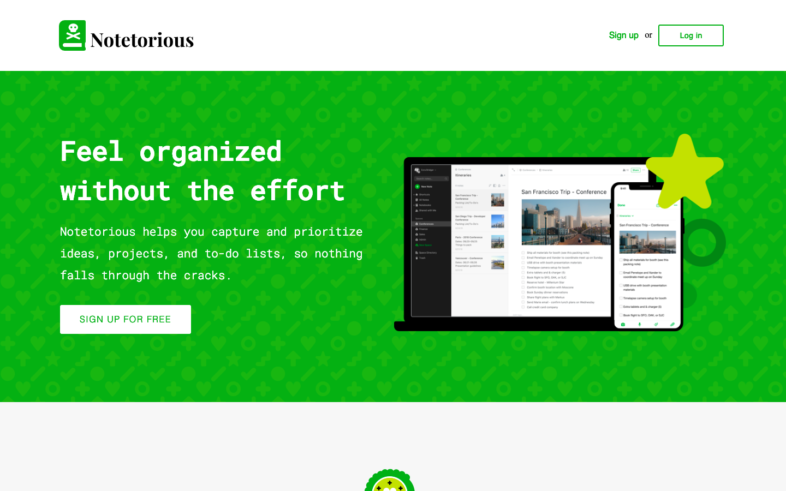
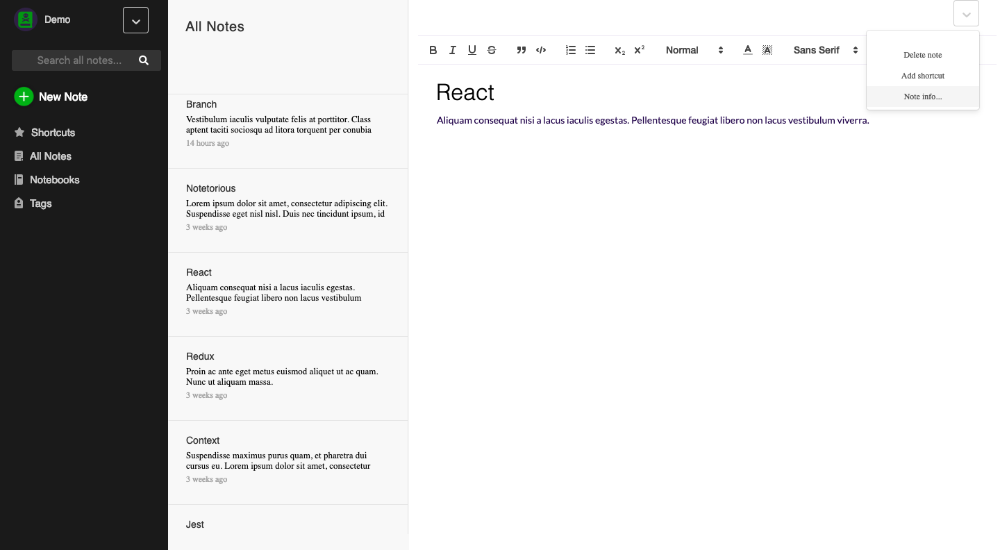
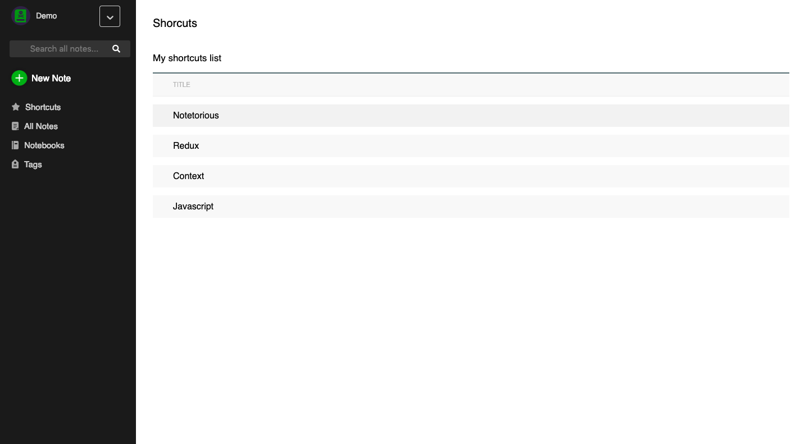

# Notetorious

_[Trello](https://trello.com/b/BAHg7c4m/notetorious-evernote-app)_

## MVP

Notetorious is a full-stack web application fully inspired by Evernote and built with Postgres, Express, React/Redux and NodeJS. Like Evernote, this clone's mvp aims to help users stay organized by allowing them to create, modify, tag, and store notes in notebooks.

## Features

- New account creation, login, and guest/demo login
- A production README
- Hosting on Heroku
- Notes (CRUD)
- Notebooks (CRUD)
- Rich-text editing(Quill.js/Draft.js)
- Tags (Categorize)

## Design Docs

- [View Wireframes](./wireframes)
- [API Endpoints](./api-endpoints.md)
- [DB Schema](./schema.md)
- [React Components](./component-hierarchy.md)
- [Sample State](./sample-state.md)

## Screenshots

## Implementation Timeline

### Phase 1: Backend setup (3 days)

- **Objective:** Functioning Express project with necessary routes and placeholder home page

### Phase 2: Notes (3 days)

- **Objective:** Implement CRUD via API. Research/choose Quill/Draft for rich text editing

### Phase 3: Notebooks (3 days)

- **Objective:** Implement CRUD via API. Filter notes by notebooks. Style notebook view, include dropdown for belonging notes

### Phase 4: Tags (3 day)

- **Objective:** Multiple tags can be added to one note. Notes can be untagged and tags can be deleted

### Extra Features: (TBD)

- Frontend/Backend Authentication
- Add search for notes, notebooks and tags
- Favorite notes shortcuts
- Create Reminders for Notes
- Multiple sessions
- Add checklist/todo
- Allow sharing of notes/notebooks via social media
- Autosave while editing
- Collaboration on notes
- Pagination / Infinite scroll
